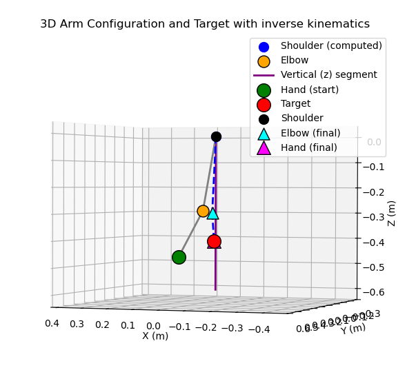
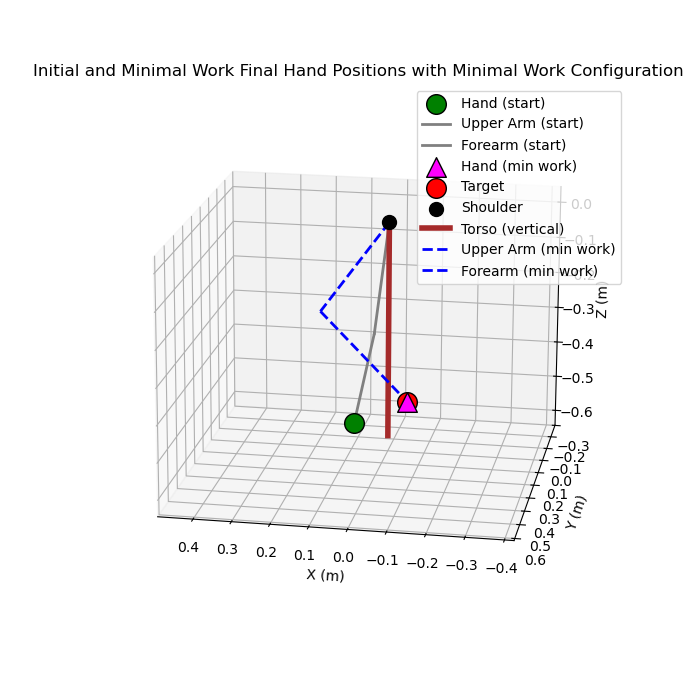
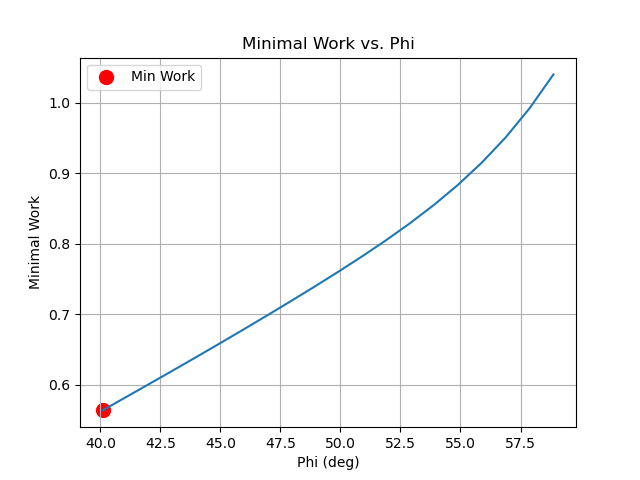

# Planning Movements in a Simple Redundant Task

Code from the work of : 
- Soechting, J & Buneo, Christopher & Herrmann, U & Flanders, M. (1995). Moving effortlessly in three dimensions: Does Donders' law apply to arm movement?. The Journal of neuroscience : the official journal of the Society for Neuroscience. 15. 6271-80. 10.1523/JNEUROSCI.15-09-06271.1995. [https://doi.org/10.1523/JNEUROSCI.15-09-06271.1995](https://doi.org/10.1523/JNEUROSCI.15-09-06271.1995)
- Vetter, Philipp & Flash, Tamar & Wolpert, Daniel. (2002). Planning Movements in a Simple Redundant Task. Current biology : CB. 12. 488-91. 10.1016/S0960-9822(02)00715-7. 

---

## 🧭 **Overview**

This repository reproduces the computational framework proposed by **Soechting et al. (1995)** to explore how human arm postures are determined when reaching in three dimensions.  The **final arm configuration tends to minimize mechanical work of the movement**, suggesting that arm movements are organized to minimize energy expenditure.

This implementation uses:
- A **4-DOF (degree-of-freedom)** kinematic arm model  
- A **Quadratic Programming (QP)** controller for inverse kinematics  
- A **kinetic energy–based optimization** function to evaluate minimal work

---

## ⚙️ **Scientific Background**

### 🧠 Motivation
Experiments by Soechting et al. (1995) showed that arm posture at a given hand position depends on the starting configuration. However, this dependence could be predicted by assuming that the **final armposture minimizes the mechanical work** required to transport the arm between positions.

### 🔬 Theoretical Model

The arm is modeled as a two-link manipulator (upper arm + forearm) with four joint angles:

| Symbol | Description |
|---------|-------------|
| `η` | Shoulder yaw (rotation about vertical Z-axis) |
| `θ` | Shoulder elevation (angle of the arm relative to vertical) |
| `ζ` | Humeral rotation (rotation about arm’s long axis) |
| `φ` | Elbow flexion |

The **instantaneous mechanical work** is proportional to the system’s kinetic energy:

\[
W = \frac{1}{2} I \omega^2 + \text{interaction terms}
\]

where:
- \( I \) represents the composite moments of inertia for the upper arm and forearm  
- \( \omega \) is the angular velocity vector

The **minimal work posture** corresponds to the configuration that minimizes \( W \), subject to the constraint that the hand reaches the desired 3D target.

---

## 🧩 **Repository Structure**

📂 **2002_Vetter**
│
├── **Vetter2002_redundancy.py**                        # Main simulation script (provided code)
├── **QP_solver.py**                   # Arm kinematics, Jacobian, and QP-based controller
├── **FourDLArm_func.py**              # Analytical and numerical IK/FK solvers
├── **Soechting1995_minimal_work.pdf** # Reference research article
├── **Vetter2002_redundancy.pdf** # Reference research article
│
└── **README.md**                      # You are here


---

## 🧠 **Key Components**

### 1. `Arm` Class (`QP_solver.py`)
Defines the 4-DOF arm kinematics for the QP Solver:
- `fkine(q)`: computes 3D hand (end-effector) position  
- `fkine_elbow(q)`: computes elbow position  
- `jacobe(q)`: computes the end-effector Jacobian matrix  
- `plot(ax)`: 3D visualization of the arm segments

### 2. `QPController` Class (`QP_solver.py`)
Implements a **Quadratic Programming (QP)** controller to solve inverse kinematics:

\[
\min_{\dot{q}} \| J \dot{q} - \dot{x} \|^2 + \alpha \| N (\dot{q} - \dot{q}_{des}) \|^2
\]

where:
- \( J \): Jacobian  
- \( \dot{x} \): desired end-effector velocity  
- \( N = I - J^+ J \): nullspace projector  
- \( \dot{q}_{des} = \alpha W_{null}(q_{null} - q) \): secondary task (nullspace regulation)

Uses the **OSQP** solver through the `qpsolvers` library.

### 3. `FourDLArm_func.py`
Provides analytical and numerical classical kinematic functions:
- `direct_kinematics()`
- `inverse_kinematics()`
- `compute_jacobian()`
- `ik_with_nullspace()`

### 4. `main.py`
Main simulation script that:
1. Defines physical and inertial parameters (from Soechting et al.)
2. Sets up the 4-DOF arm model and controller
3. Computes inverse kinematics to reach a 3D target
4. Evaluates the **minimal work posture**
5. Generates visualizations:
   - 3D arm movement plots
   - Work vs. kinematic plots

---

## 🧰 **Dependencies**

Install the required Python libraries:

```bash
pip install numpy matplotlib pandas scipy qpsolvers
```

## ▶️ Usage

Run the main simulation:

```bash
python main.py
```

### Expected Outputs

3D visualization of the arm:




2D plot of kinetic energy vs. posture (e.g., elbow flexion angle φ)




Printed results in terminal:

```bash
Minimal work configuration (η, θ, ζ, φ) : [np.float64(-60.92598029693698) np.float64(40.0866209472249)  np.float64(116.73108355361984) np.float64(66.73759155081356)  np.float64(0.5633931855084866)]
```

## ⚙️ Configurable Parameters

You can modify these parameters in main.py:

| **Parameter**       | **Description**                          | **Default**             |
|----------------------|------------------------------------------|--------------------------|
| `L1`, `L2`           | Upper arm and forearm lengths (m)        | `0.30`, `0.30`          |
| `Kp`                 | Proportional gain for controller          | `0.5`                   |
| `alpha`              | Weight for nullspace secondary task      | `0.5`                   |
| `start_q`            | Initial joint angles [deg]               | `[-20, 15, 10, 40]`     |
| `target`             | Target (x, y, z) [m]                     | `[-0.10, 0.3, -0.4]`    |
| `use_minimal_work`   | Enable work optimization                 | `True`                  |
| `dt`                 | Integration timestep (s)                 | `0.01`                  |
