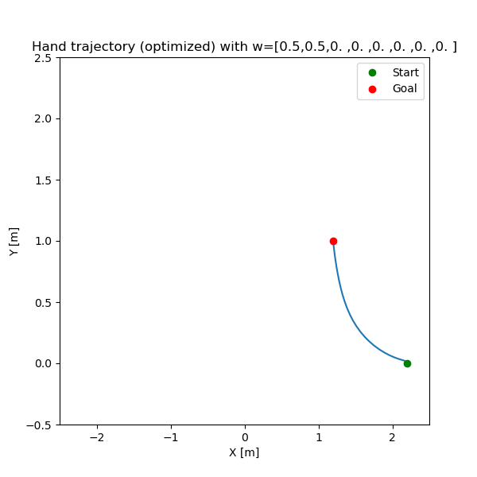
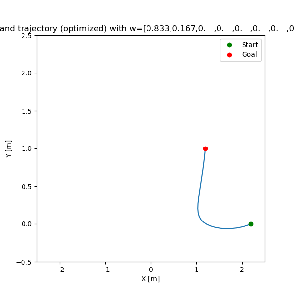
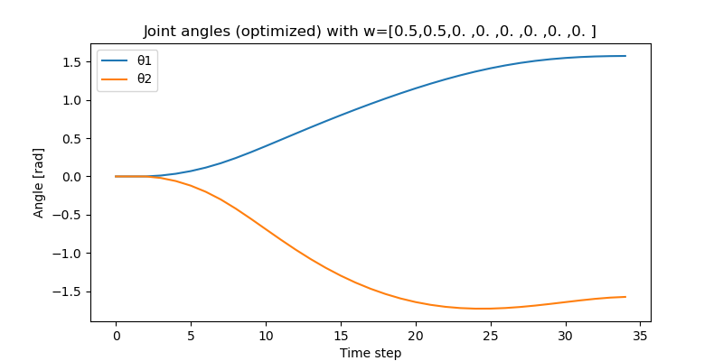
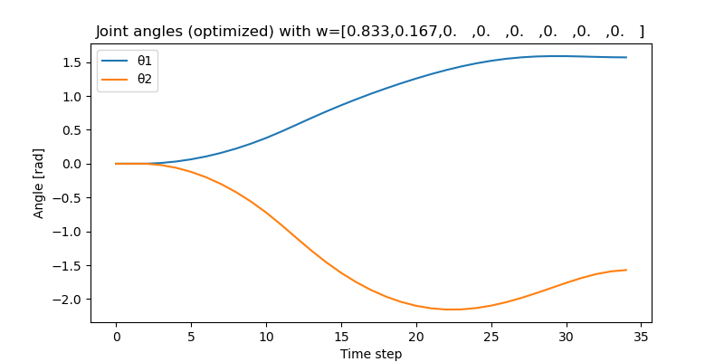
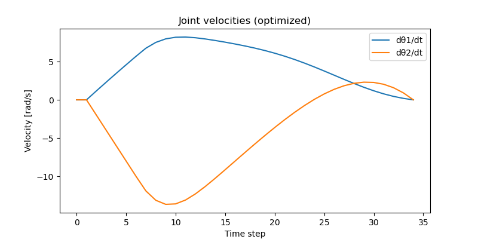
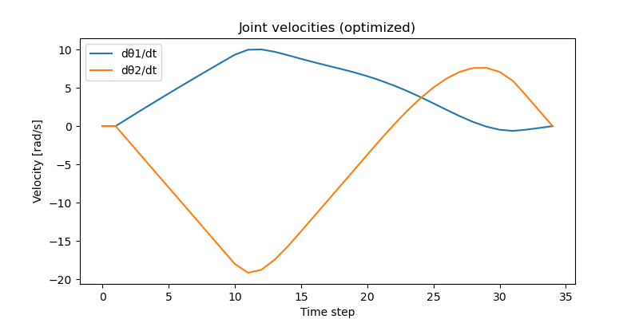
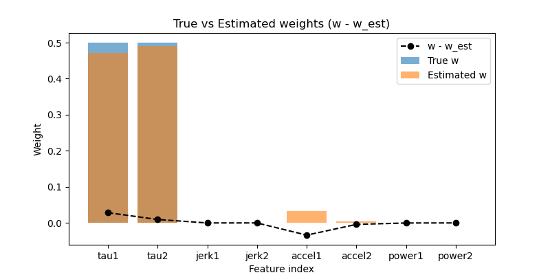
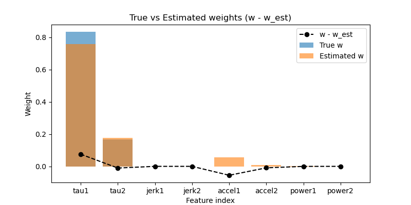

# 🧠 Inverse Optimal Control Reliability — Implementation of Colombel et al. (2022)

This repository contains a Python implementation of the methodology presented in the paper:

> **Jessica Colombel, David Daney, and François Charpillet**  
> *“On the Reliability of Inverse Optimal Control”*  
> *IEEE International Conference on Robotics and Automation (ICRA), 2022.*

---

## 📄 Overview

Inverse Optimal Control (IOC) seeks to **recover the cost function weights** that explain an observed trajectory, assuming the motion results from the optimization of some underlying criterion.

This project reproduces the main ideas and experiments from the paper, focusing on:
- Solving the IOC problem using **Karush-Kuhn-Tucker (KKT) conditions**;
- Analyzing the **reliability of the recovered solution** through **Singular Value Decomposition (SVD)** of the KKT system matrix;
- Simulating a **two-link robotic arm** and verifying the reliability of solutions under different model configurations and noise levels.

---

## 🧩 Method Summary

The IOC method is based on evaluating the KKT conditions:

\[
J_\omega \omega + J_\lambda \lambda = 0
\]

where:
- \( J_\omega = \frac{\partial C}{\partial s} \) are derivatives of the cost functions,
- \( J_\lambda = \frac{\partial f}{\partial s} \) are derivatives of the equality constraints.

The full KKT matrix \( J = [J_\omega, J_\lambda] \) is analyzed using **SVD**:

\[
J = U S V^T
\]

The **smallest singular value** and **rank drop** are used as indicators of reliability:
- If the rank deficiency of \( J \) is **1**, the last singular vector \( V_L \) gives a valid IOC solution.
- If full rank or multiple singular values are small, the solution is considered unreliable.

---

## ⚙️ Features Implemented

- **Two-link robotic arm model** with complete dynamics:
  - Inertia \( M(\theta) \), Coriolis \( R(\theta, \dot{\theta}) \), and gravity \( g(\theta) \).
- **Cost function set** (as in Table I of the paper):
  1. \( \tau_1^2 \)
  2. \( \tau_2^2 \)
  3. \( \text{jerk}_1^2 \)
  4. \( \text{jerk}_2^2 \)
  5. \( \ddot{\theta}_1^2 \)
  6. \( \ddot{\theta}_2^2 \)
  7. \( (\dot{\theta}_1\tau_1)^2 \)
  8. \( (\dot{\theta}_2\tau_2)^2 \)
- **Direct Optimal Control (DOC)** using `scipy.optimize.minimize`
- **Inverse Optimal Control (IOC)** via SVD-based solution of KKT equations
- **Analytic Jacobian computation** (`analytic_J_omega`) for efficiency
- **Reliability assessment** using singular value ratios and positivity of recovered weights
- Optional **PDF export** of plots (`save_image` function)

---

## 🧮 File Structure

.
├── Colombel2022.pdf        # Original reference paper
├── Colombel2022.py         # Full Python implementation
└── README.md               # This documentation


---

## 🚀 Usage

### 1. Install dependencies
```bash
pip install numpy scipy matplotlib
```

### 2. Run the example

```bash
python Colombel2022.py
```
This will:
- Generate synthetic optimal trajectories for multiple weight configurations;
- Apply the IOC solver (solve_kkt_ioc) to recover the weights;
- Print diagnostic information (singular values, residuals, rank drop);
- Optionally save plots as PDFs in the working directory.
## 📊 Key Functions

| Function | Description |
|-----------|-------------|
| `solve_DOC()` | Generates an optimal trajectory given a reference weight vector `ω_ref` |
| `solve_kkt_ioc()` | Solves the Inverse Optimal Control problem using KKT and SVD |
| `analytic_J_omega()` | Computes analytical derivatives of cost functions with respect to states |
| `features_vector()` | Defines all cost function components used in the paper |
| `save_image()` | Saves all open matplotlib figures to a multi-page PDF |

---

## 🧠 Reliability Indicators

- **Rank drop = 1** → reliable IOC solution  
- **Rank full** → trajectory not optimal for the assumed model  
- **Multiple small singular values** → ambiguous solution  
- **Negative ω components** → non-convex criterion → reject solution  

---

## 🧩 Example Interpretation

Each trajectory corresponds to a unique weight configuration (`ω_ref`) as in Table I of the paper.  
By solving the IOC problem for each simulated trajectory, you can verify:
- Whether the recovered weights match `ω_ref`;
- How noise and missing/extra cost terms affect reliability.

--- 

## 👁️ Visual Results

Exemples of results for 2 different weight vectors (corresponding to the weights of the features presented in the previous section) : w_1 = [0.5, 0.5, 0, 0, 0, 0, 0, 0] and w_2 = [0.833, 0.163, 0, 0, 0, 0, 0, 0]



*Figure: End-effector (hand) position trajectory computed with IKKT formulation.*



*Figure: joints position computed with IKKT formulation.*



*Figure: joints velocity computed with IKKT formulation.*



*Figure: Weight comparisons between the one used for DOC and the one recovered with IOC based on IKKT formulation.*
---

## 📚 References

- Colombel, J., Daney, D., & Charpillet, F. (2022).  
  *On the Reliability of Inverse Optimal Control.*  
  *IEEE International Conference on Robotics and Automation (ICRA).*  
  DOI: [10.1109/ICRA.2022](https://ieeexplore.ieee.org/document/9812064)

---
